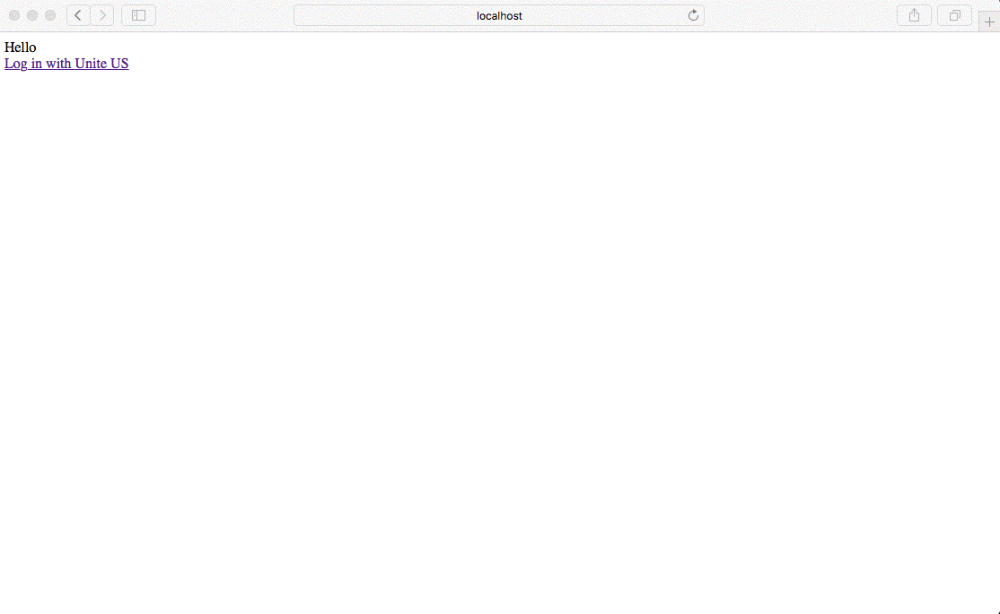

# Unite US Example OAuth 2.0 Consent
An example web application used to capture user consent for third-party applications that connect to Unite US via OAuth 2.0.



## Configuration
The following environment variables should be provided to configure the consent application.

| Variable Name | Description | Example Value | 
| ------------- | ----------- | ------------- |
| `CLIENT_ID` | Your client application's _Client ID_. | `cdeaba99-df85-46e5-925a-9120aa9a76e7` |
| `CLIENT_SECRET` | Your client application's _Client Secret_. | `RYxXp9%JSqSS.$9DX?lGowE9UG` |
| `CLUSTER_URL` | The location of the authentication provider. | `https://auth.domain.com` |
| `LISTEN_TO` | Host for the application should run on/listen to. | `3000` |

## Authorization Code flow
The Authorization Code flow is made up from two parts. At first your application asks to the user the permission to access their data. 
If the user approves the OAuth2 server sends to the client an authorization code. In the second part, the client POST the authorization 
code along with its client secret to the oauth server in order to get the access token.

The example application will print the authorization code exchange result to the browser. You should store these details in your persistent data store.

```text
{
    "token": {
        "access_token: "-2rAzoZRJ8HvDNJ_fCtzPOjDKhsTMtNWKmyGU6hsNW8.LvAWAV8gfAOIqkIm-C437L4RQXQPlE1ZIIZGBRXGfTg",
        "expires_in": 3600,
        "refresh_token": "G6zVre00RJiODinigIh7r_HajGe2Q6fTUaUD4LKJaO0.ju2clvd34-uLMyrJcBtpblqjDJoYYxEU_YoKzoExnec",
        "scope": "offline",
        "token_type": "bearer",
        "expires_at": "2017-04-14T17:56:36.487Z"
    }
}
```
   
## Running the Application
```bash
# Install the dependencies
npm install
# Set Environment Variables and Run
# Line breaks added for readability
CLIENT_ID=cdeaba99-df85-46e5-925a-9120aa9a76e7 \
    CLIENT_SECRET=RYxXp9%JSqSS.$9DX?lGowE9UG \
    LISTEN_TO=3000 \
    CLUSTER_URL=https://auth.domain.com \
    node index.js
```

## License
The example OAuth2 web application is licensed under the [MIT License](LICENSE.txt)